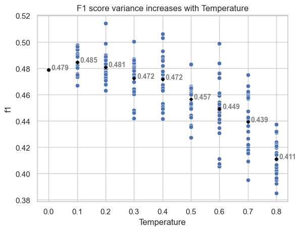
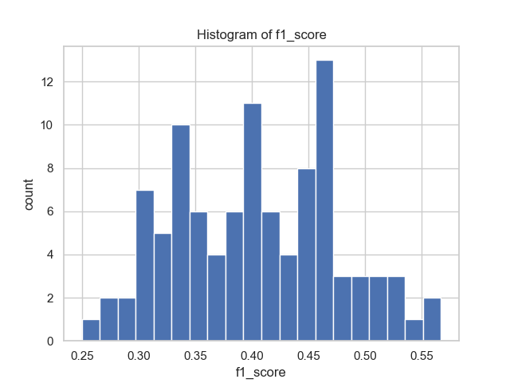
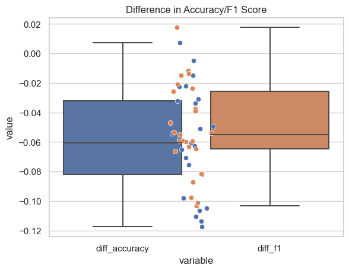

# Improving the performance of an LLM task

## The Task

The task is text classification of Yelp reviews -- the review text is given and it has to categorized into a 5 star rating. The dataset is a 10000 review subset of the full Yelp dataset with all features but `text` and `stars` removed. The dataset was downloaded from [Kaggle](https://www.kaggle.com/code/omkarsabnis/sentiment-analysis-on-the-yelp-reviews-dataset/data) and can be seen [here](data/1raw/yelp.csv)

For classification, below are the different models and modes that were tried. 
As can be seen: 

- **zero shot** only starts to perform well with davinci. 
- **few shot** is doing ok on curie and amazingly well on davinci reaching a level that is close to the state of the art for the task ([see here](https://paperswithcode.com/sota/text-classification-on-yelp-5))
- **Fine-tuning** works well on the lower end models, but strangely tops out on babbage with curie only performing marginally better than ada (I have yet to get access to davinci fine-tuning). 
- **Embedding + AutoML** works the well on curie and almost as well on ada. 

| Model   | Technique          |   Accuracy |   F1 Score | job                         |
|:--------|:-------------------|-----------:|-----------:|:----------------------------|
| ada     | fine-tune          |     0.5263 |     0.4855 | nan                         |
| ada     | embedding + AutoML |     0.6195 |     0.6127 | musing_cart_wjzb12p2        |
| ada     | zero shot          |     0.1095 |     0.0482 | nan                         |
| ada     | few shot           |     0.4231 |     0.4068 | patient_ship_3dg6gh430b_89  |
| babbage | fine-tune          |     0.6147 |     0.6042 | shy_picture_b0gpxgmn        |
| curie   | zero shot          |     0.2751 |     0.2510 | nan                         |
| curie   | embedding + AutoML |     0.6289 |     0.6245 | stoic_screw_jw6bywsn        |
| curie   | fine-tune          |     0.5376 |     0.5041 | nan                         |
| curie   | few shot           |     0.5799 |     0.5768 | jolly_rhythm_cnryl9j3f0_83  |
| davinci | zero shot          |     0.4763 |     0.4818 | careful_lime_ds0qyvgj4g_94  |
| davinci | few shot           |     0.6992 |     0.6982 | placid_energy_hzkj1x77wl_85 |

## Zero-shot prompt crafting

As is shown at the top, zero-shot prompts don't yield a good result for the lower end models. However, for davinci a decent score (`f1 = 0.48`) can be achieved. But it needs to be noted that small changes to the prompt can make a big difference. See below table for examples:

|       f1 | prompt                                                                                                                                 | run_uuid                      |
|---------:|:---------------------------------------------------------------------------------------------------------------------------------------|:------------------------------|
| 0.478856 | From the categories [1, 2, 3, 4, 5], select the one that best describes the Yelp review: \n{text}. \n\nThe chosen category is:         | patient_plastic_6hn9lg2ft5_14 |
| 0.473198 | From the categories [1, 2, 3, 4, 5], select the one that best describes the Yelp review: \n'{text}'. \nThe chosen category is:         | patient_plastic_6hn9lg2ft5_13 |
| 0.456552 | From the categories [1, 2, 3, 4, 5], select the one that best describes the Yelp review: \n"{text}". \n\nThe chosen category is:       | patient_plastic_6hn9lg2ft5_11 |
| 0.450386 | From the categories [1, 2, 3, 4, 5], select the one that best describes the Yelp review: {text}. The chosen category is:               | patient_plastic_6hn9lg2ft5_12 |
| 0.439162 | Assign the following Yelp review to one of the following categories: [1, 2, 3, 4, 5]\nyelp review: {text} \nclassified category:       | patient_plastic_6hn9lg2ft5_0  |
| 0.435711 | Assign the following Yelp review to one of the following categories: [1, 2, 3, 4, 5]\nyelp review: {text} \nclassified category:       | patient_plastic_6hn9lg2ft5_5  |
| 0.428406 | Assign the Yelp review: \n{text} \n\n to one of the categories [1, 2, 3, 4, 5]. \nThe assigned category is:                            | patient_plastic_6hn9lg2ft5_8  |
| 0.402765 | Classify the following Yelp review by choosing one of the categories [1, 2, 3, 4, 5]: \n{text} \nThe selected category is:             | patient_plastic_6hn9lg2ft5_7  |
| 0.401432 | Please select one of the categories [1, 2, 3, 4, 5] to categorize the Yelp review: \n{text} \nThe chosen category is:                  | patient_plastic_6hn9lg2ft5_6  |
| 0.373278 | For the Yelp review: \n{text} \n\n choose one of the categories [1, 2, 3, 4, 5] for classification. \nThe chosen category is:          | patient_plastic_6hn9lg2ft5_9  |
| 0.320869 | Sort the following Yelp review into one of the following categories: [1, 2, 3, 4, 5]\nyelp review: {text} \nclassified category:       | patient_plastic_6hn9lg2ft5_3  |
| 0.317341 | Put the following Yelp review into one of the following categories: [1, 2, 3, 4, 5]\nyelp review: {text} \nclassified category:        | patient_plastic_6hn9lg2ft5_4  |
| 0.290357 | Place the following Yelp review into one of the following categories: [1, 2, 3, 4, 5]\nyelp review: {text} \nclassified category:      | patient_plastic_6hn9lg2ft5_2  |
| 0.28206  | Categorize the following Yelp review into one of the following categories: [1, 2, 3, 4, 5]\nyelp review: {text} \nclassified category: | patient_plastic_6hn9lg2ft5_1  |

For this classification problem, tuning the hyperparameters improves the results only  minimally. It is, however, important to keep in mind that, while turning up the temperature increases the f1 score on average, it also increases the variance of the scores. This is shown in the graph below. The higher the temperature, the more the scores vary. The sweet spot seems to be around a temperature of 0.1, but the gains are modest and likely not worth the increased variance.

## Few-shot prompt crafting

Through few-shot prompt crafting it is possible to improve the quality significantly over zero shot and the overall best results (so fare) are achieved with a Davinci model. It does matter which examples are being used -- interestingly more than the number. 

From a set of 2658 examples, a fixed number was sampled (1, 3, 5, 7, or 9) and they were used to score the test dataset of 531 items. To save money, it is deliberately a bit small and probably accounts for some inaccuracy in the numbers, but it suffices as an indicator of the impact of choosing different samples on the performance of the model. 

The above shows 2 things:
Firstly, does matter quite a bit, which examples are sampled -- even with just one example, the difference between the best prompt and the worst prompt is 7 percentage points. 

To illustrate, the folling example prompt yields an f1 score of `0.6982814` ([placid_energy_hzkj1x77wl_85](https://ml.azure.com/runs/placid_energy_hzkj1x77wl_85?wsid=/subscriptions/15ae9cb6-95c1-483d-a0e3-b1a1a3b06324/resourcegroups/ray/workspaces/ray)):

    You are given a dataset of Yelp reviews, and your task is to classify them into one of five categories: 1 star, 2 stars, 
    3 stars, 4 stars, and 5 stars. You are provided with a small number of labeled examples to use as a reference, and you 
    must use these to classify the rest of the reviews.

    For example, you might be given the following labeled examples:

    Review 1: "It seems like there is not as much value for your dollar at Gold Medal.  We had been there since the new school 
    opened but decided to move on.  We got a 'can't we get you to stay' call which felt like desperation on their part.  My 
    daughter enjoyed her lessons but her favorite teacher left (as most do) and the cost was not worth it anymore.  I would not 
    recommend them to my friends." (label: 2 stars)

    Review 2: "We started each morning of our vacation at The Breakfast Club.  Everything was so tasty; juices are fresh-squeezed.  
    Menu has quite a variety and portions are very filling  It gets busy early.  Be sure to give it a try." (label: 5 stars)

    Review 3: "The main reason to miss a star is that the one that we ordered (the mint-lamb) was a bit dry to my taste and no mint 
    to taste at all. For desert we had the apple one and that was much better. I'd like to try a different one some other time and 
    compare :).\n\nGood environment, and for groups, friendly staff who would explain you what they are cooking!!" (label: 3 stars)

    Based on these examples, you should be able to classify the following review:

    Review: {text}

    label: 

And for contrast, this prompt yields an f1 score of `0.6151146` ([placid_energy_hzkj1x77wl_16](https://ml.azure.com/runs/placid_energy_hzkj1x77wl_16?wsid=/subscriptions/15ae9cb6-95c1-483d-a0e3-b1a1a3b06324/resourcegroups/ray/workspaces/ray)):

    You are given a dataset of Yelp reviews, and your task is to classify them into one of five categories: 1 star, 2 stars, 
    3 stars, 4 stars, and 5 stars. You are provided with a small number of labeled examples to use as a reference, and you 
    must use these to classify the rest of the reviews.

    For example, you might be given the following labeled examples:

    Review 1: "Good coffee and they always take care of what i need in a timely manner. Never mind the fact it is literally 
    20 yards from my front door, but that may play into my liking of the establishment.  Either way you should check it out 
    and enjoy some free Wifi." (label: 4 stars)

    Review 2: "Loved the winkie!  Eat your vegan meal next door at Green and stroll over to Nami for dessert." (label: 5 stars)

    Review 3: "I stopped in here at 6:45am one morning and was told I was a bit early.  I'm used to coffee shops opening 
    earlier I guess, but they were nice about it and invited me in to sit and wait. \n\nI liked their stacks of Latin American 
    Vogue, and the artwork on the walls was nice.  They also had ice water out for you to serve yourself. \n\nI ordered my 
    usual americano, and was pleased.  They have raw sugar you can serve yourself by the heaping spoonful out of a pretty 
    candy dish.  That was lovely.\n\nAlso, they are now the only place to carry Sweet Peas Bakery items.  My favorite 
    thing to do was walk down to Danielle's shop downtown and pick up some coffee at Royal and some of her Rosemary Shortbread 
    cookies.  It doesn't sound yummy, but believe me they are!  Be sure to ask for some. \n\nAt the time I went, the place was 
    obviously not crowded and I received attentive service..." (label: 3 stars)

    Review 4: "We went to American Junkie after we found a 50% discount from http://www.restaurant.com. They couldn't pay us 
    to go back.\n\nIf you like velvet ropes, not being able to talk to the person next to you because the music is so loud, 
    and being around people who are really into themselves, American Junkie is your spot." (label: 1 star)

    Review 5: "I got the banana nutella cupcake and love the banana bread-like cupcake. However, the frosting is way too 
    sweet and overpowers the banana flavor of the cupcake. As many reviewers have already mentioned, the cupcake is also 
    over-priced at $3.75 each for the size and the lack of creativity. \nWith so many desert/snack places in Scottsdale, 
    I am unlikely to come back here." (label: 2 stars)

    Based on these examples, you should be able to classify the following review:

    Review: {text}

    label: 

It is not clear what makes the first prompt so much better than the second one (maybe the sarcasm in Review 4 is lost on Davinci), in any case, finding the best prompt (or one close) is clearly a matter systematic experimentation.

The second finding from the above graph is that the the number of examples used matters far less than their contents. It does matter whether 1 or more than one example is chosen, but things get quite ambiguous for more than 3. The table below shows the p_values of a t-test comparing the distributions of the f1 values the different numbers of examples. As can be seen, except for 1, there distributions are not statistically significantly different (7 and 9 are barely stat sig.):

|  p values  |           1 |           3 |          5 |           7 |          9 |
|---:|------------:|------------:|-----------:|------------:|-----------:|
|  1 | 1           | 3.16601e-05 | 0.00150419 | 6.62454e-06 | 0.00235842 |
|  3 |  | 1           | 0.306457   | 0.542522    | 0.0858296  |
|  5 |   |     | 1          | 0.122199    | 0.58932    |
|  7 |               |     |    | 1           | 0.0243348  |
|  9 |  |   |    |    | 1          |

## Fine-Tuning
- There is no obvious way to get to the best hyperparameter values for fine-tuning without a decent number of runs. Based on about 300 runs, the best model so far was a `babbage` model with a batch size of `4`, a learning rate multiplier of `0.285`, and it was trained for `10` epochs. 

- Outof the first 100 runs, the best model was 16 percentage points better than the median and mean models, which one might hope to arrive at through a handful of manually crafted runs.

| stat | value |
| --- | --- |
| count |   83.000000 |
| mean    |  0.403587 |
| min     | 0.249653|
| 50%    |   0.404316|
| max      | 0.566951|

### Difference in performance between classification metrics reported and measured

Strangely, I am seeing quite a difference between the classification metrics reported by the AOAI fine-tuning (`classification/accuracy` and `classification/f1_score_weighted`) and the same metrics measured by deplying the fine-tuned model and then running the same test set through it.

Here is the graph of the difference between the two metrics for the different models. You would expect the dots to be close to the identity line, instead they are consistently below it.

Here a boxplot that better shows the size of the differences. On average, the difference is around 5 percentage points, which is quite significant.

Looking at which accuracies are affected the most, (maybe expectedly) there is a slight increase in difference as the accuracy increases:

After some investigation, I am able to reproduce the same numbers that are reported by the fine-tuning if the validation dataset from the fine-tuning is used. Most other datasets sampled from the full yelp-5 dataset, however, show a significatn deviation as shown above. So, it seems that the fine-tuning is overfitting on the validation dataset (or that the valdiation set is not sufficiently representative of the overall dataset). It is only 532 records (which is 5% of the dataset) -- a larger validation dataset should likely fix the issue. 

### Issues:

- AOAI: Having only accuracy and f1_score as metrics to evaluate is quite limiting. In the case of a Yelp 1-5 rating, it seems that RMSE might be a better metric to optimize for. Not sure if modeling this as a regression task would be feasible or advised with OpenAI. 

- AzureML: To enable early stopping, we need to allow the job to react to cancellation by hyperdrive, such that the fine_tune operation on the AOAI side get's cancelled, too (https://msdata.visualstudio.com/Vienna/_workitems/edit/1351560)

- AzureML: cannot see other than primary metric in the table of trials

- AOAI: Where is the reference documentation for the AOAI Python SDK? 

- AOAI: Where is the documenation for the Azure-specific extensions to the AOAI service, for instance hyperparameters to control **LORA**?

## Embedding

Using LLMs to extract an embedding is a very simple way to arrive at surprisingly good results even with the lowest end model (ada). The whole dataset is being passed through the model and the resulting embedding is being used to train a simple classifier model. I used AutoML to do the optimization of the classifier model for me.

Ada provides a 1024 dimensional embedding while davinci provides a 2048 dimensional embedding. The following table shows the results of the classification task using the embeddings as features:

| Model   |  size |   best model Accuracy |  best model F1 Score | Classifier | job |
|:--------|-----:|-----------:|-----------:|:----------------------------|----|
| ada     | 1024 |   0.619535 |   0.612792 | TruncatedSVDWrapper, LogisticRegression | musing_cart_wjzb12p2        |
| curie   | 2048 |   0.628976 |   0.624561 | SparseNormalizer, LightGBM | stoic_screw_jw6bywsn        |

Currently we don't offer embeddings for davinci or babbage on the AOAI service.

## Jobs To Be Done

JTBDs for using LLMs with AzureML:
1. LLM model selection: As a data scientist, I want to choose a model from a set of LLMs based on the task-type (text classification, token classification, sentence-similarity, etc.). I want to learn about the different models and test them out interatively.
1. Prompt-crafting: As a data scientist, I want to be able to craft the prompt for the LLM(s) of my choice. I want to 
*formally experiment* with different prompts (incl. zero-shot, few-shot) and see how they perform on different datasets using different hyperparameters. I want to be able to track the results of my prompt-crafting jobs. In the end, I want to be able to choose the best prompt for my task and create a model from it.
1. Fine-tuning: As a data scientist, for the fine-tuning jobs I run, I want to be able track my which datasets, models, and hyperparameters were used in which experiments an which results were achieved. 
2. Hyperparameter tuning: As a data scientist, I want to be able to tune the hyperparameters of my fine-tuning jobs efficiently (distribute workload across a cluster, track each run, stop poor runs, efficiently sample from search space, graph results).
4. Model abstraction: As a data scientist, I want to be able to wrap my fine-tuned or prompt-crafted model together with the choose the best prompt for my task and create a model from it that I can take to other tasks like RAI analysis, deployment, batch inferencing, etc.
6. RAI: As a data scientist, I want to be able to run RAI analysis on my fine-tuned models
7. Batch Inferencing: As a data scientist, I want to be able to run batch inferencing jobs on my fine-tuned models
8. Model deployment: As a data scientist, I want to be able to deploy my fine-tuned models to production

see also: [24+25 SOTA Deck](https://microsoft.sharepoint.com/:p:/r/teams/Vienna/_layouts/15/Doc.aspx?sourcedoc=%7BE6D3871A-4CB9-4285-A2F7-E9FF83C93762%7D&file=SOTA-1.3.pptx&action=edit&mobileredirect=true&share=IQEah9PmuUyFQqL36f-DyTdiAaAn-1wXNqUsoDQ2AXi-8Do)

JTBDs for AOAI with AzureML:
1. Recognize same models: As a data scientist, I want recognize the models that I am offered AOAI in AzureML, so I can use what I might have used in AOAI for the above LLM JTBDs.
1. Transfer fine-tuned models: As a data scientist, I want to be able to transfer my fine-tuned models from AOAI to AzureML, so that I can use them for RAI analysis, batch inferencing, etc.
1. Transfer deployed models: As a data scientist, I want to be able to transfer my deployed models from AOAI to AzureML, so that I can use them for RAI analysis, batch inferencing, etc.
