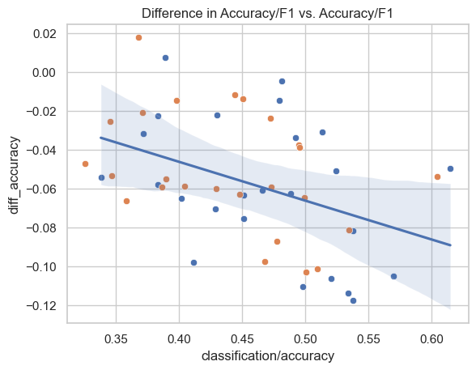

## Findings

### Fine-tuning is useful.

For classification, below are the different models and modes that were tried. As can be seen, **zero shot** only starts to perform well with davinci. **Fine-tuning** works well on the lower end models, but strangely fails to show improvements on curie. **Embedding + AutoML**, however, works very well on curie. 

| Model | Technique | Accuracy | F1 Score |
| --- | --- | -- | -- |
| ada | fine-tune | 0.5263 | 0.4855 |
| babbage | fine-tune | 0.5733 | 0.5669 |
| curie | fine-tune | 0.5376 | 0.5041 |
| curie | no shot | 0.2751 | 0.2510 |
| curie | embedding + AutoML | 0.6241 | 0.6202 |
| davinci | no shot | 0.4763 | 0.4785 |

### Hyperparameter tuning for fine-tuning is useful. 
- There is no obvious way to get to the best hyperparameter values for fine-tuning without a decent number of runs. The best model so far was a `babbage` model with a batch size of `4`, a learning rate multiplier of `0.17`, and it was trained for `10` epochs. The next best model was an `ada` model with batch size of `8`, a learning rate multipler of `0.11`, and it was trained for `15` epochs. After 83 runs for the given problem, data and prompt crafting, it seems that a `babbage` model with a small batch size (`4`), `20` epochs and a learning rate multiplier of around `0.15` might be a good choice. 

- Outof 100 runs, the best model was 16 percentage points better than the median and mean models, which one might hope to arrive at through a handful of manually crafted runs.

| stat | value |
| --- | --- |
| count |   83.000000 |
| mean    |  0.403587 |
| min     | 0.249653|
| 50%    |   0.404316|
| max      | 0.566951|

## Issues:

- AOAI: Having only accuracy and f1_score as metrics to evaluate is quite limiting. In the case of a Yelp 1-5 rating, it seems that MSE might be a better metric to optimize for. Not sure if modeling this as a regression task would be feasible or advised with OpenAI. 

- AzureML: To enable early stopping, we need to allow the job to react to cancellation by hyperdrive, such that the fine_tune operation on the AOAI side get's cancelled, too (https://msdata.visualstudio.com/Vienna/_workitems/edit/1351560)

- AzureML: cannot see other than primary metric in the table of trials

- AOAI: Where is the reference documentation for the AOAI Python SDK? 

- AOAI: Where is the documenation for the Azure-specific extensions to the AOAI service, for instance hyperparameters to control **LORA**?

### Difference in performance between classification metrics reported and measured

Strangely, I am seeing quite a difference between the classification metrics reported by the AOAI fine-tuning (`classification/accuracy` and `classification/f1_score_weighted`) and the same metrics measured by deplying the fine-tuned model and then running the same test set through it.

Here is the graph of the difference between the two metrics for the different models. You would expect the dots to be close to the identity line, instead they are consistently below it.

Here a boxplot that better shows the size of the differences. On average, the difference is around 5 percentage points, which is quite significant.

Looking at which accuracies are affected the most, (maybe expectedly) there is a slight increase in difference as the accuracy increases:

## Jobs To Be Done

JTBDs for using LLMs with AzureML:
1. LLM model selection: As a data scientist, I want to choose a model from a set of LLMs based on the task-type (text classification, token classification, sentence-similarity, etc.). I want to learn about the different models and test them out interatively.
1. Prompt-crafting: As a data scientist, I want to be able to craft the prompt for the LLM(s) of my choice. I want to 
*formally experiment* with different prompts (incl. zero-shot, few-shot) and see how they perform on different datasets using different hyperparameters. I want to be able to track the results of my prompt-crafting jobs. In the end, I want to be able to choose the best prompt for my task and create a model from it.
1. Fine-tuning: As a data scientist, for the fine-tuning jobs I run, I want to be able track my which datasets, models, and hyperparameters were used in which experiments an which results were achieved. 
2. Hyperparameter tuning: As a data scientist, I want to be able to tune the hyperparameters of my fine-tuning jobs efficiently (distribute workload across a cluster, track each run, stop poor runs, efficiently sample from search space, graph results).
4. Model abstraction: As a data scientist, I want to be able to wrap my fine-tuned or prompt-crafted model together with the choose the best prompt for my task and create a model from it that I can take to other tasks like RAI analysis, deployment, batch inferencing, etc.
6. RAI: As a data scientist, I want to be able to run RAI analysis on my fine-tuned models
7. Batch Inferencing: As a data scientist, I want to be able to run batch inferencing jobs on my fine-tuned models
8. Model deployment: As a data scientist, I want to be able to deploy my fine-tuned models to production

see also: [24+25 SOTA Deck](https://microsoft.sharepoint.com/:p:/r/teams/Vienna/_layouts/15/Doc.aspx?sourcedoc=%7BE6D3871A-4CB9-4285-A2F7-E9FF83C93762%7D&file=SOTA-1.3.pptx&action=edit&mobileredirect=true&share=IQEah9PmuUyFQqL36f-DyTdiAaAn-1wXNqUsoDQ2AXi-8Do)

JTBDs for AOAI with AzureML:
1. Recognize same models: As a data scientist, I want recognize the models that I am offered AOAI in AzureML, so I can use what I might have used in AOAI for the above LLM JTBDs.
1. Transfer fine-tuned models: As a data scientist, I want to be able to transfer my fine-tuned models from AOAI to AzureML, so that I can use them for RAI analysis, batch inferencing, etc.
1. Transfer deployed models: As a data scientist, I want to be able to transfer my deployed models from AOAI to AzureML, so that I can use them for RAI analysis, batch inferencing, etc.
