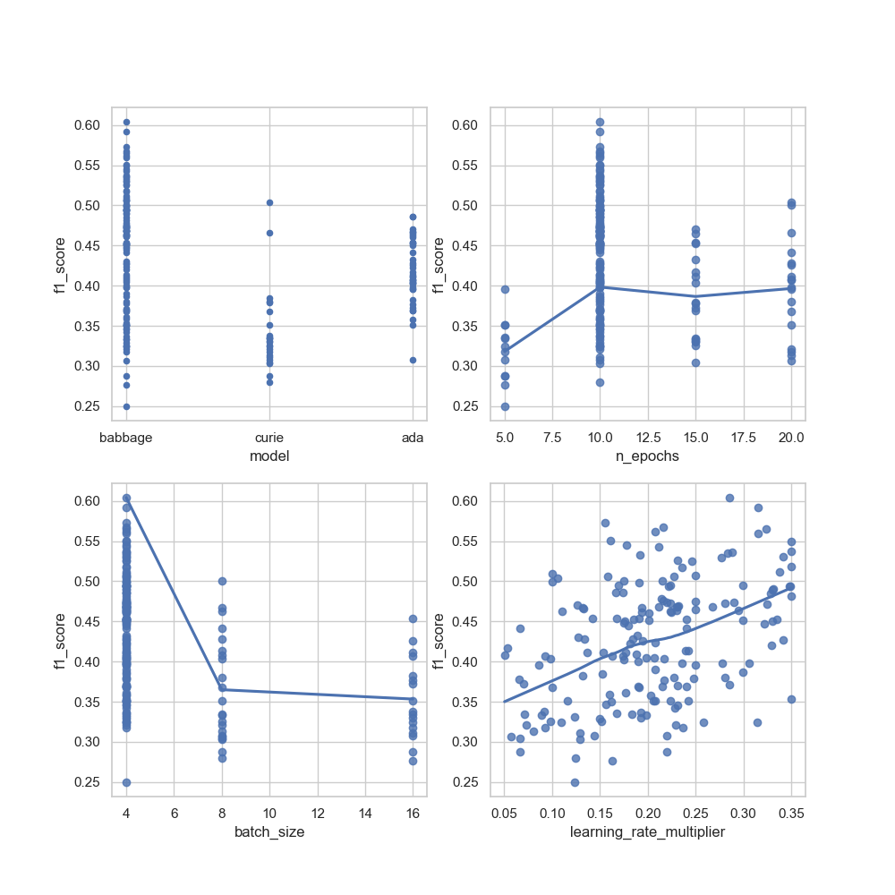

## Findings
### Hyperparameter tuning for fine-tuning is useful. 
- There is no obvious way to get to the best hyperparameter values for fine-tuning without a decent number of runs. The best model so far was a `babbage` model with a batch size of `4`, a learning rate multiplier of `0.19`, and it was trained for 20 epochs. The next best model was an `ada` model with batch size of `8`, a learning rate multipler of `0.11`, and it was trained for 15 epochs. After 83 runs for the given problem, data and prompt crafting, it seems that a `babbage` model with a small batch size (`4`), `20` epochs and a learning rate multiplier of around `0.15` might be a good choice. 

- Outof 83 runs, the best model was 20 percentage points better than the median model, which one might hope to arrive at through a handful of manually crafted runs.

| stat | value |
| --- | --- |
| count |   83.000000 |
| mean    |  0.265154 |
| min     | 0.008580|
| 50%    |   0.307420|
| max      | 0.506950|

- Even if we drop all runs that have an f1 score below 0.1, the best model is still >17 percentage points better than the median (and the mean) model.

| stat | value |
| --- | --- |
| count   | 65.000000
| mean |     0.335467 
|min|       0.219880
|50% |      0.332230
|max |     0.506950

- In addition, early stopping would be really useful, if only to cut off the runs on the left of the histogra that are doing so poorly that they don't exceed 0.1 percent.

## Issues:

- AOAI: Having only accuracy and f1_score as metrics to evaluate is quite limiting. In the case of a Yelp 1-5 rating, it seems that MSE might be a better metric to optimize for. Not sure if modeling this as a regression task would be feasible or advised with OpenAI. 

- AzureML: To enable early stopping, we need to allow the job to react to cancellation by hyperdrive, such that the fine_tune operation on the AOAI side get's cancelled, too (https://msdata.visualstudio.com/Vienna/_workitems/edit/1351560)

- AzureML: cannot see other than primary metric in the table of trials

- AOAI: Where is the reference documentation for the AOAI Python SDK? 

- AOAI: Where is the documenation for the Azure-specific extensions to the AOAI service, for instance hyperparameters to control **LORA**?
