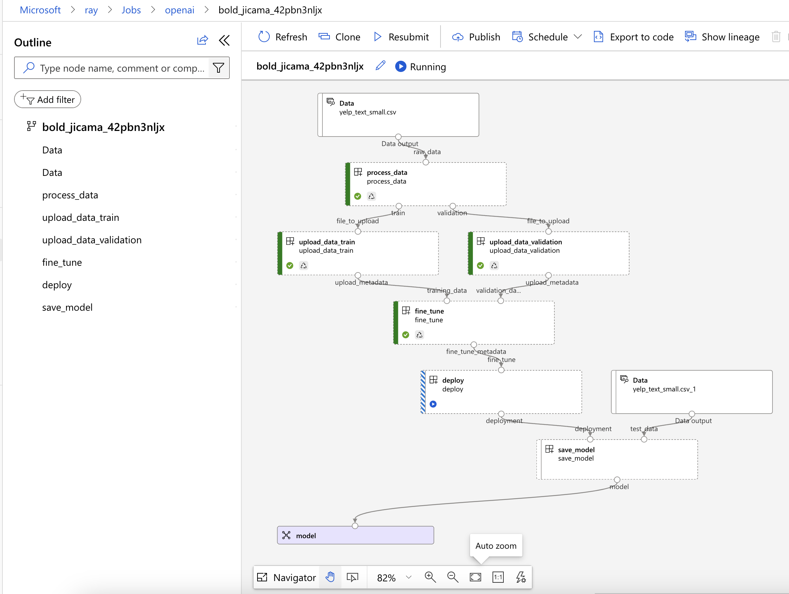

# AzureML and Azure OpenAI

This repository contains a sample project that demonstrates how to use Azure Machine Learning to fine-tune and deploy a model using Azure OpenAI.

## Prerequisites

- Azure subscription
- Azure Machine Learning Workspace
- Azure OpenAI endpoint

## Setup

Install the AzureML CLI:
- see here for details on how to install the Azure CLI: https://docs.microsoft.com/en-us/cli/azure/install-azure-cli
- see here for details on how to install the AzureML CLI: https://learn.microsoft.com/en-us/azure/machine-learning/how-to-configure-cli?tabs=public

For AzureML to be able to access your Azure OpenAI endpoint, you need to add the OpenAI API Key to the AzureML workspace's key vault. In order to do that:

1. Locate the key of the Azure OpenAI endpoint in the Azure portal and copy it to the clipboard


2. Open the AzureML workspace in the Azure Portal and navigate to the key vault


4. Add a new secret with the name `openai-key` and the value of the key


5. Create a compute cluster named `cpu-cluster`
```shell
az ml compute create --name cpu-cluster --type amlcompute --min-instances 0 --max-instances 4 --size STANDARD_D2_V2 --idle-time-before-scale-down 3600
```

7. Run the full pipeline
```shell
az ml job create -f 0pipeline.yaml
```


Only if you want to run the python code locally:
6. Create the conda environment
```shell
conda env create -f conda.yml
conda activate openai
```
7. Set the OPENAI_API_KEY environment variable
```shell
export OPENAI_API_KEY=<your key from step 1 above>
```